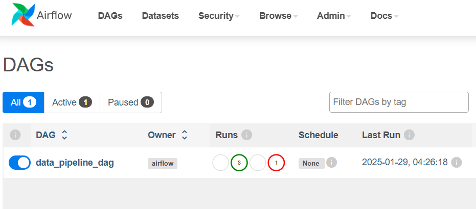
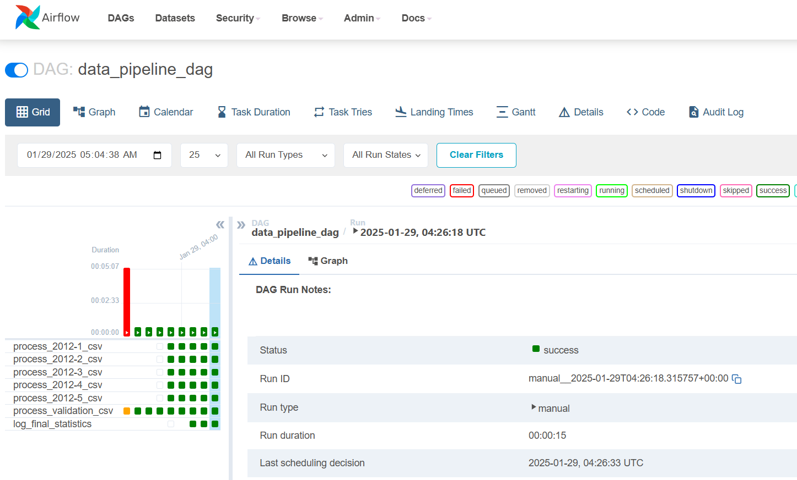

# Data Pipeline with Airflow and PostgreSQL

This project demonstrates a data pipeline that processes CSV files in micro-batches, calculates statistics dynamically, and stores the data in a PostgreSQL database. The pipeline is orchestrated using Apache Airflow.

## Table of Contents
1. [Overview](#overview)
2. [Prerequisites](#prerequisites)
3. [Setup Instructions](#setup-instructions)
4. [Pipeline Execution](#pipeline-execution)
5. [Troubleshooting](#troubleshooting)
6. [Example Results](#example-results)
7. [Project Structure](#project-structure)
8. [License](#license)

## Overview
The pipeline performs the following:
- Processes CSV files (2012-1.csv to 2012-5.csv) in order, then validation.csv.
- Dynamically updates statistics (row count, min, max, avg) after processing each file.
- Uses PostgreSQL to store data and Airflow to orchestrate tasks.

## Prerequisites
Ensure you have the following installed:

### Operating System
- **Ubuntu** (Recommended version: 20.04 or later)

### Software
- **Docker**: Used to create and manage containers for PostgreSQL and Airflow.
- **Docker Compose**: To orchestrate multiple Docker containers.
- **Python 3.7+**: For running the processing scripts.
- **Git**: For cloning and managing the repository.

### Python Libraries
Install the following Python libraries using `pip`:
```bash
pip install pandas psycopg2 sqlalchemy
```

## Setup Instructions

### Step 1: Clone the Repository
```bash
git clone <repository-url>
cd <repository-folder>
```

### Step 2: Set Up Docker Containers
1. **Initialize Docker services**:
   ```bash
   sudo docker-compose up -d
   ```
   This will start the PostgreSQL and Airflow services.

2. **Check if Docker containers are running**:
   ```bash
   sudo docker ps
   ```

3. **Initialize the Airflow database**:
   ```bash
   sudo docker exec -it airflow-webserver airflow db init
   ```

4. **Create an admin user for Airflow**:
   ```bash
   sudo docker exec -it airflow-webserver airflow users create        --username admin --firstname Admin --lastname User        --role Admin --email admin@example.com --password admin
   ```

5. Access the Airflow UI at [http://localhost:8080](http://localhost:8080).

### Step 3: Set Up the Data Directory
1. Place all CSV files (2012-1.csv to validation.csv) in the `data` directory inside the `dags` folder:
   ```bash
   mv path_to_csv_files/*.csv ./dags/data/
   ```

2. Ensure the data folder permissions are set correctly:
   ```bash
   sudo chmod -R 777 dags/data
   ```

### Step 4: Verify PostgreSQL Database
1. Access the PostgreSQL container:
   ```bash
   sudo docker exec -it airflow-db psql -U root -d data_pipeline_db
   ```

2. Verify the `transactions` table exists:
   ```sql
   \dt
   ```

3. If the table does not exist, create it:
   ```sql
   CREATE TABLE public.transactions (
       timestamp TIMESTAMP,
       price NUMERIC,
       user_id INT
   );
   ```

4. Exit the database:
   ```bash
   \q
   ```

## Pipeline Execution
1. Navigate to the Airflow UI at [http://localhost:8080](http://localhost:8080).
2. Activate the `data_pipeline_dag`.

3. Trigger the DAG by clicking on the "Trigger DAG" button.
4. Monitor the tasks in the Airflow UI to ensure successful execution.


## Troubleshooting
- **Permission Errors**:
  If you encounter permission issues with the `dags/data` directory:
  ```bash
  sudo chmod -R 777 dags/data
  ```

- **Database Connection Issues**:
  If the database connection fails:
  1. Verify the database container is running:
     ```bash
     sudo docker ps
     ```
  2. Check the `DB_HOST` value in the `main.py` file matches the service name in `docker-compose.yml`.

- **Airflow Scheduler Not Running**:
  Ensure the Airflow scheduler is active:
  ```bash
  sudo docker exec -it airflow-scheduler airflow scheduler
  ```

## Example Results
After successfully running the pipeline, the statistics will be logged to the console. Example:

```bash
Processed /opt/airflow/dags/data/2012-1.csv | Rows: 50 | Min: 5 | Max: 100 | Avg: 52.5
Processed /opt/airflow/dags/data/2012-2.csv | Rows: 100 | Min: 5 | Max: 120 | Avg: 63.0
...
Database Statistics: Rows: 500, Avg: 60.0, Min: 5, Max: 150
```

## Project Structure
```
.
├── dags/
│   ├── data_pipeline_dag.py   # Airflow DAG definition
│   ├── data/                  # Directory containing CSV files
├── scripts/
│   ├── main.py                # Main script for processing CSV files
├── docker-compose.yml         # Docker Compose configuration
└── README.md                  # Project documentation
```

## License
This project is licensed under the MIT License by Carlos Aquino Perez.
